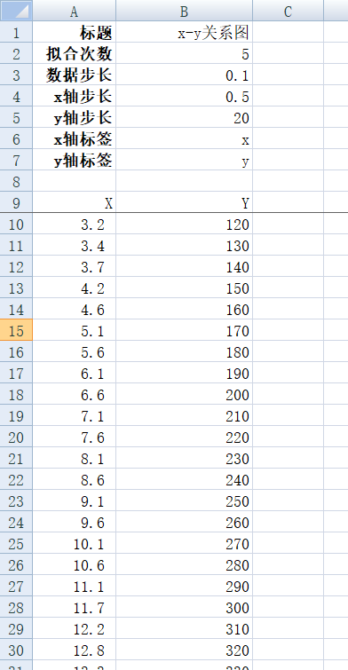
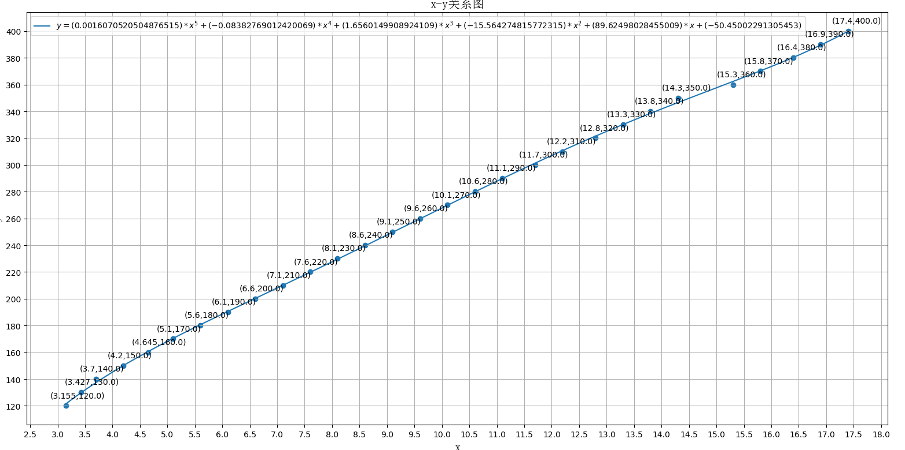

# python-fittinx曲线拟合

项目地址：https://github.com/mr-program/python-fitting

基于python的曲线拟合工具

设置说明：

最高支持到5次方曲线拟合

标题：图标的标题名称

拟合次数：拟合成几次方函数

数据步长：X输入的数据步长，用于初始化数据

x轴步长：x轴显示步长值

y轴步长：y轴显示步长值

x轴标签：x轴显示的标签

y轴标签：y轴显示的标签

x,y分别表示输入的x数据和y数据。

适用方法：

python3 fitting.py

运行效果：

